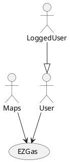
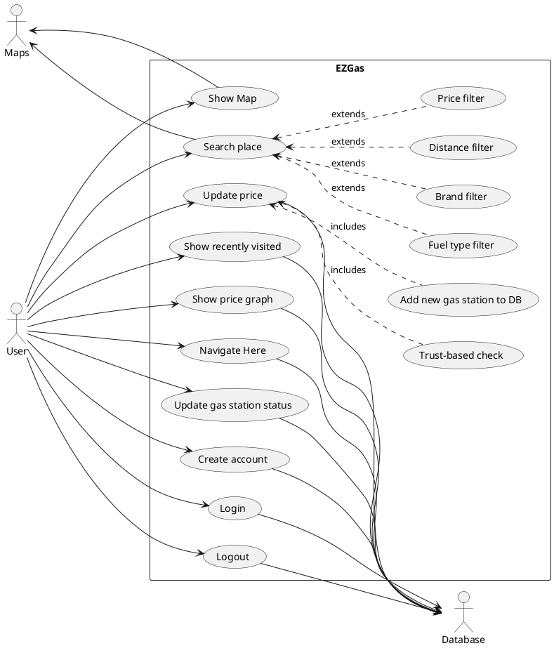
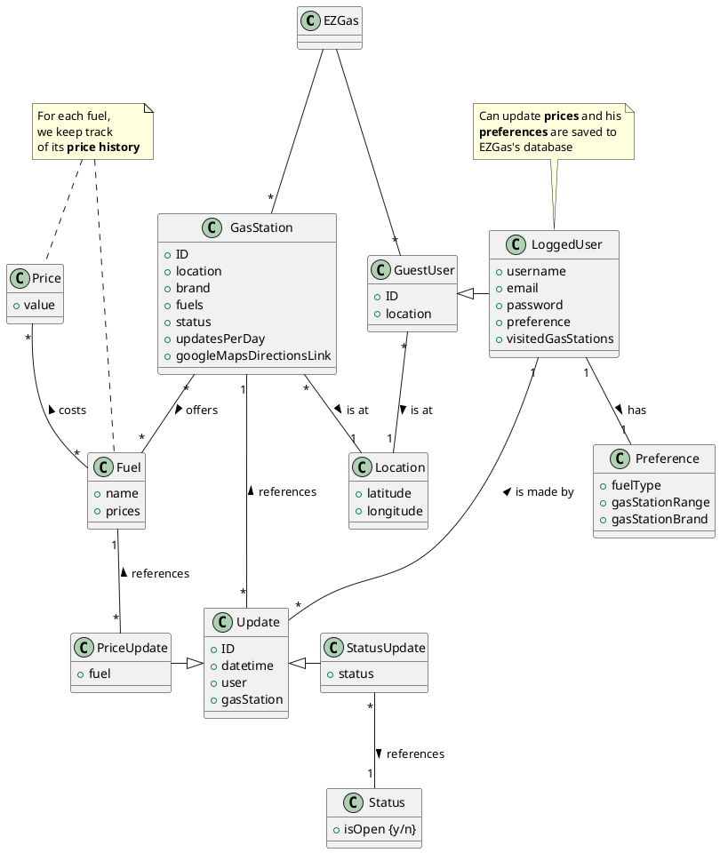
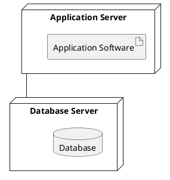

# Requirements Document

Authors: Enrico Castelli s280124, Augusto Maria Guerriero s278018, Francesca Ponzetta s276535, Monica Rungi s276979

Date: 17/04/2020

Version: 1

# Contents

- [Stakeholders](#stakeholders)
- [Context Diagram and interfaces](#context-diagram-and-interfaces)
	+ [Context Diagram](#context-diagram)
	+ [Interfaces](#interfaces)

- [Stories and personas](#stories-and-personas)
- [Functional and non functional requirements](#functional-and-non-functional-requirements)
	+ [Functional Requirements](#functional-requirements)
	+ [Non functional requirements](#non-functional-requirements)
- [Use case diagram and use cases](#use-case-diagram-and-use-cases)
	+ [Use case diagram](#use-case-diagram)
	+ [Use cases](#use-cases)
    	+ [Relevant scenarios](#relevant-scenarios)
- [Glossary](#glossary)
- [System design](#system-design)
- [Deployment diagram](#deployment-diagram)

# Stakeholders

| Stakeholder name  | Description |
| ----- |:-----------:|
| Users | Use EZGas either actively, by updating gas prices, or passively, by checking gas prices other users have set up |
| Developers | Add features to EZGas, fix bugs of EZGas, release the app, deploy and update any server-side software |
| Database | Contains all the prices that users upload to EZGas |
| Maps | Provide an API to access gas station locations |

# Context Diagram and interfaces

## Context Diagram

## Interfaces
| Actor | Logical Interface | Physical Interface  |
| ------------- |:-------------:| -----:|
| User  | GUI               | Touchscreen / screen, mouse and keyboard |
| Database | Internet Access | Server network cable |
|Open street maps| REST API v 0.6 as described in https://wiki.openstreetmap.org/wiki/API_v0.6| Internet link|

# Stories and personas

Tom Honks is a truck driver always on the move. His company pays for gas, but he would like to start off on the right foot with the new boss. He is determined to find a way to reduce company costs to make a good impression and hopefully get a promotion to an office job, so he can stay more regularly at home with his family.
He finally finds the solution to his problem: EZGas, a crowd-sourced application that allows all the truck drivers in his company to determine at which gas station to stop.

Antonio is a man who has moved from Puglia to Piemonte for a job. Everytime he has to go on holiday to Puglia, he travels with his car. Moreover the car runs on natural gas, so it is really difficult to find a gas station suitable for his car. As the trip is really long, he would like to know where the gas stations are and where the prices are convenient, in order to save money. EZGas would be perfect for him, because, according to where he is, he could find the nearest gas station with the best prices.

Jared, 18 years old, just had his car bought as a present from his parents. He goes to high school, doesn't study a lot and his professors report that he doesn't behave well towards his classmates. Jared recently got to know about EZgas from one of his classmates and decided to download it to mess up the system by uploading wrong data. The developers of EZGas have thought about this chance, so Jared is left without the satisfaction of messing up the database.

# Functional and non functional requirements

## Functional Requirements

| ID        | Description  |
|:---------:|:------------:|
|  FR1      | Show nearby world map |  
|  FR2      | Search for a place on the map |
|  FR2.1    | Filter search based on distance from user |
|  FR2.2    | Filter search based on lowest price |
|  FR2.3    | Filter search based on type of fuel |
|  FR2.4    | Filter search based on gas station brand |
|  FR3      | Show recently visited gas stations |
|  FR4      | Record updated gas station price to database |
|  FR4.1    | Perform trust-based check before updating price |
|  FR4.2    | Add new gas station to database if not present |
|  FR5      | Produce a graph of price fluctuations for a given station |
|  FR6      | Open link to maps with directions to a given station |
|  FR7      | Record gas station status |
|  FR8      | Create account |
|  FR8.1    | Login |
|  FR8.2    | Logout |

## Non Functional Requirements

| ID        | Type        | Description  | Refers to |
| ------------- |:-------------:| :-----:| -----:|
|  NFR1     |  Portability | Application should run in a web browser, both mobile and desktop | All FR |
|  NFR2     | Performance | All functions should take less than 5 seconds when using 4G or 5G | All FR |
|  NFR3     | Performance | All functions should take less than 10 seconds when using 3G | All FR |
|  NFR4     | Performance | All functions should take less than 30 seconds when using 2G | All FR |
|  NFR5     | Localisation | Application should support EN and IT locales | All FR |
|  NFR6     | Usability | Application should be used with no previous training  | All FR |

# Use case diagram and use cases

## Use case diagram

### Use case 1, UC1 - FR1 Show nearby world map
| Actors Involved        | User as U, Maps as M |
| ------------- |-------------|
|  Precondition  | U is using EZGas, M are available on the Internet |  
|  Post condition | M displayed on U's screen |
|  Nominal Scenario | User opens EZGas and sees Maps around him |
|  Variants | Maps not available, issue error |
| | Internet connection not available, issue warning |

### Use case 2, UC2 - FR2 Search for a place on the map
| Actors Involved        | User as U, Maps as M |
| ------------- |-------------|
|  Precondition  | U is using EZGas, M are available on the Internet, Location L exists |  
|  Post condition | Location searched is displayed on U's screen |
|  Nominal Scenario | U searches for L and L is displayed on M |
|  Variants | M not available, issue error |
| | Internet connection not available, issue warning |
| | Location does not exist, issue warning |

### Use case 3, UC3 - FR2.1 Filter search based on distance from user
| Actors Involved        | User as U, Maps as M |
| ------------- |-------------|
|  Precondition  | U is using EZGas, M are available on the Internet, User Location UL exists |  
|  Post condition | The nearest gas stations to UL are displayed on U's screen |
|  Nominal Scenario | U searches for nearest gas stations |
|  Variants | M not available, issue error |
| | Internet connection not available, issue warning |

### Use case 4, UC4 - FR2.2 Filter search based on lowest price
| Actors Involved        | User as U, Maps as M |
| ------------- |-------------|
|  Precondition  | U is using EZGas, M are available on the Internet, User Location UL exists |  
|  Post condition | The gas stations with the lowest price in a default or user-selected range are displayed on U's screen |
|  Nominal Scenario | U searches for gas stations with lowest price |
|  Variants | M not available, issue error |
| | Internet connection not available, issue warning |

### Use case 5, UC5 - FR2.3 Filter search based on type of fuel
| Actors Involved        | User as U, Maps as M |
| ------------- |-------------|
|  Precondition  | U is using EZGas, M are available on the Internet, User Location UL exists, Type of Fuel TF is an acceptable value |  
|  Post condition | The nearest gas stations to UL which offer TF are displayed on U's screen |
|  Nominal Scenario | U searches for nearest gas stations which offer TF |
|  Variants | M not available, issue error |
| | Internet connection not available, issue warning |

### Use case 6, UC6 - FR2.4 Filter search based on gas station brand
| Actors Involved        | User as U, Maps as M |
| ------------- |-------------|
|  Precondition  | U is using EZGas, M are available on the Internet, User Location UL exists, Brand B is an acceptable value |  
|  Post condition | The nearest gas stations to UL which are of brand B are displayed on U's screen |
|  Nominal Scenario | U searches for nearest gas stations of brand B |
|  Variants | Maps not available, issue error |
| | Internet connection not available, issue warning |

### Use case 7, UC7 - FR3 Show recently visited gas stations
| Actors Involved        | Logged User as LU |
| ------------- |-------------|
|  Precondition  | LU is using EZGas, DB is available on the Internet |  
|  Post condition | DB entries are pulled and displayed |
|  Nominal Scenario | LU taps searchbar on screen, a brief list of the most recently visited gas stations appears |
|  Variants | Internet connection not available, issue warning |
| | Database not available, issue error |
| | LU is not logged in, no list of recent visited gas stations displayed |

### Use case 8, UC8 - FR4 Record updated gas station price to database
| Actors Involved        | Logged User as LU, Maps as M |
| ------------- |-------------|
|  Precondition  | LU is using EZGas, M are available on the Internet, Database DB is available on the Internet, type of fuel TF is offered by gas station GS. LU is at a predefined distance from the gas station. |  
|  Post condition | DB entry is updated,  GS is saved in recently visited GSs |
|  Nominal Scenario | U taps GS on M and inputs new price NP and TF, uploaded to DB |
|  Variants | Maps not available, issue error |
| | Internet connection not available, issue warning |
| | Database not available, issue error |
| | Price validation error, issue error |
| | LU is not in the predefined distance from the gas station, the DB is not updated |

### Use case 9, UC9 - FR4.1 Perform trust-based check before updating price
| Actors Involved        |  |
| ------------- |-------------|
|  Precondition  |  New price NP is received at DB |  
|  Post condition | NP is saved to DB |
|  Nominal Scenario | The prices older than N days are removed. If NP is within a margin of error (e.g. 0.1€) from the last X user-submitted prices, then the price for that gas station and that type of fuel is updated to the average of the last X prices and is displayed in-app to the users; the last X prices are removed from the database. X is calculated based on how many NPs are received per day at each gas station, and is a gas station property. |
| | Else, save NP to DB. |

### Use case 10, UC10 - FR4.2 Add new gas station to database if not present
| Actors Involved        | Logged User as LU |
| ------------- |-------------|
|  Precondition  | LU is using EZGas and he is at a predefined distance from the gas station. Maps M are available on the Internet, Database DB is available on the Internet, new price NP for the fuel of a new gas station GS is received at DB |  
|  Post condition | GS is saved to DB |
|  Nominal Scenario | If GS is not already present in DB, it gets added, along with NP. |
| | Else, save NP to DB. |

### Use case 11, UC11 - FR5 Produce a graph of price fluctuations for a given station
| Actors Involved        |  |
| ------------- |-------------|
|  Precondition  | Price history of gas station GS is pulled to application from DB |  
|  Post condition | Application shows the corresponding graph on the screen |
|  Nominal Scenario | Price history of GS is shown graphically in application |
|  Variants | GS is not in DB, issue error |
| | GS does not have a price history, issue warning |

### Use case 12, UC12 - FR6 Open link to maps with directions to a given station
| Actors Involved        | User as U |
| ------------- |-------------|
|  Precondition  | U is using EZGas, GS's location exists in DB |
|  Post condition | Application opens external link to maps, GS is saved in recently visited GSs |
|  Nominal Scenario | U selects GS, U clicks on "Directions" for said GS, EZGas app opens external link to maps with direction to GS: link is based on stored coordinates |
|  Variants | The maps link is not in DB, issue message |
| | Internet connection not available, issue warning |
| | Database not available, issue error |
| | EZGas is accessed from smartphone and has a maps app installed, link is opened inside the maps app |
| | EZGas is accessed from smartphone and maps app is not installed, link is opened in phone's default app |
| | EZGas is accessed from PC, link is opened in new tab in browser |

### Use case 13, UC13 - FR7 Record gas station status
| Actors Involved        | Logged User as LU |
| ------------- |-------------|
|  Precondition  | LU sees in real life that gas station GS is either temporarily closed or under maintenance, or has re-opened after being temporarily closed or under maintenance |  
|  Post condition | The status of GS is updated in DB |
|  Nominal Scenario | LU sees GS is closed, LU logs into the app, LU updates the status of GS, the status of GS is updated in DB |
|  Variants | LU sees GS has re-opened, LU logs into the app, LU updates the status of GS, the status of GS is updated in DB |
| | The status of GS is the same as the new one set by LU, issue warning |

### Use case 14, UC14 - FR8 Create account
| Actors Involved | User as U |
| ------------- |-------------|
|  Precondition  | U is using EZGas, U sends username UN, e-mail address A and password P to DB |  
|  Post condition | A new locked user account is created in DB, a confirmation e-mail is sent to A |
|  Nominal Scenario | U registers on EZGas, U receives a confirmation e-mail at A |
|  Variants | P does not respect security standards, issue error |
| | A is not a valid e-mail address, issue error |

### Use case 15, UC15 - FR8.1 Login
| Actors Involved | User as U |
| ------------- |-------------|
|  Precondition  | U is using EZGas, U sends e-mail address A and password P to DB |  
|  Post condition | U is logged in |
|  Nominal Scenario | U logs into EZGas with A, P |
| | A is not a valid e-mail address, issue error |
| | A is not in DB, issue error |
| | No A,P correspondence in DB, issue error |

### Use case 16, UC16 - FR8.2 Logout
| Actors Involved | User as U |
| ------------- |-------------|
|  Precondition  | U is using EZGas, U is logged in |  
|  Post condition | U is logged out |
|  Nominal Scenario | U logs out of EZGas by pressing a logout button |
|  Variants | U is not logged in, issue warning |

## Relevant Scenarios

| Scenario ID: SC1 |  Corresponds to UC2-UC6 |
| ------------- |:-------------:|
|  Description  | User searches for a gas station in EZGas using the available filters |
|  Precondition     | U is using EZGas, Maps M are available on the Internet, Location L exists |
|  Post condition     | One or more gas stations are displayed on U's screen |
| Step #        | Description  |
|  1     | U sets the distance filter in order to search for the nearest Gas station (optional)  |  
|  2     | U sets the type of fuel filter in order to search a gas station according to the type of fuel he needs (optional) |
|  3     | U sets the price filter in order to search for the gas station with the lower prices of fuels (optional) |
|  4     | U sets the brand filter in order to search for the gas station belonging to a particular branch (optional) |
|  5     | U searches for a gas station and the gas station is displayed on the screen  |
|  6     | There are no gas stations corresponding to the U's needs, the application returns an error  |

| Scenario ID: SC2 |  Corresponds to UC8-UC10 |
| ------------- |:-------------:|
|  Description  | User records the current fuel price for the gas station they are at |
|  Precondition     | U is using EZGas, Maps M are available on the Internet,  Database DB is available on the Internet,U has an account on EZGas and he is logged in|
|  Post condition     | Database entry is updated |
| Step #        | Description  |
|  1     | U notices that a gas station has no previous prices registered to EZGas, so he adds the new Gas station together with at least a fuel with its price |
|  2     | U notices that the price of a fuel has changed compared to the price showed by EZGAs, so he update the price  |
|  3     | Before adding the new price, the DB checks if the price is coherent with the last N prices of that fuel in that gas station, the change is not saved in the DB |

| Scenario ID: SC3 |  Corresponds to UC14-UC16 |
| ------------- |:-------------:|
|  Description  | User manages their account by creating it, logging in, and logging out |
|  Precondition     | U is using EZGas|
|  Post condition     | U has an account on EZGas |
| Step #        | Description  |
|  1     | U sends his username, e-mail address and password to the DB and a new account is created and a confirmation mail is sent to the e-mail address |
|  2     | U sends his e-mail address and password to DB, the DB checks if there's an account associated to that e-mail and if the password is correct. If so, the user logs in  |
|  3     | U is logged in, he presses the log out button in order to log out |

| Scenario ID: SC4 |  Corresponds to UC7 |
| ------------- |:-------------:|
|  Description  | User checks which are the gas stations they have most recently visited |
|  Precondition     | User U is logged in, Database DB is available on the Internet|
|  Post condition     | Database entries are pulled and displayed |
| Step #        | Description  |
|  1     | The application keep track of the most recently visited gas station, so when the user taps the searchbar a brief list of the most recently visited gas stations appears |
|  2    | The list of the most recently visited gas stations is not available if: U is not logged, DB is not available, Internet connection is not available |

| Scenario ID: SC5 |  Corresponds to UC12 |
| ------------- |:-------------:|
|  Description  | User navigates to a gas station found via EZGas |
|  Precondition     | U is logged in, Database DB is available on the Internet|
|  Post condition     | External link to maps is opened, GS is saved in recently visited GSs |
| Step #        | Description  |
|  1     | U selects a GS |
|  2     | U taps on "Directions" link in app |
|  3     | App opens external link to maps |
|  4     | App saves GS to recently visited GSs |

| Scenario ID: SC6 |  Corresponds to UC13 |
| ------------- |:-------------:|
|  Description  | User updates the status of a gas station |
|  Precondition     | U is logged in, U sees in real life that gas station GS is either temporarily closed or under maintenance, or has re-opened after being temporarily closed or under maintenance|
|  Post condition     | The status of GS is updated in DB |
| Step #        | Description  |
|  1     | U sees that a GS is closed, he checks the status of that GS in EZGas and if the status is 'open' it updates the status to 'close' |
|  2     | U sees that a GS is opened, he checks the status of that GS in EZGas and if the status is 'close' it updates the status to 'open' |

# Glossary

# System Design
No system design, the application is a software-only product.

# Deployment Diagram

